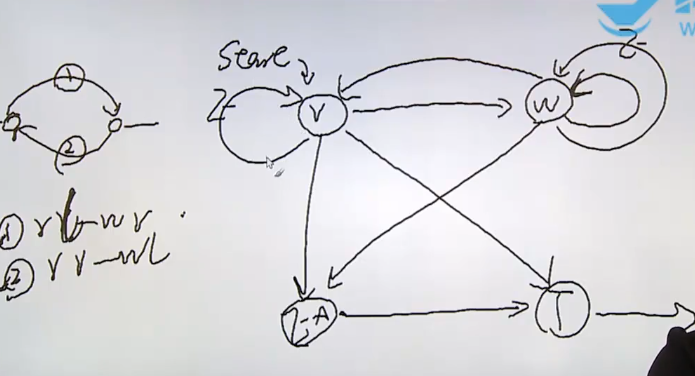

**非阻塞IO --- 阻塞IO**
在阻塞 I/O模式下，当一个进程或线程发起 I/O 操作（如读取数据、写入数据）时，它会阻塞并等待 I/O 操作完成。如果操作没有完成，线程会一直处于挂起状态，直到 I/O 完成并返回数据或确认操作成功。

非阻塞 I/O模式下，发起 I/O 操作时，线程或进程不会被阻塞，而是立即返回一个错误EAGAIN。即使数据不可用，线程也不会停止执行，而是继续执行后续的代码。线程可以通过反复检查 I/O 操作的状态（例如使用 poll() 或 select()），或者通过回调机制等待 I/O 操作完成。
对非阻塞套接字进行写操作时，如果系统的发送缓冲区已满，则会返回 EAGAIN。
如果你连续做read操作而没有数据可读,则会返回 EAGAIN。
有限状态机:复杂流程问题
    简单问题：如果一个程序的自然流程是结构化的，是简单流程
    复杂流程：自然流程是非结构化的，是复杂流程（顺序分支判断无法直接解决）


1. 非阻塞IO
2. IO多路转接
3. 其他读写函数
4. 存储映射IO
5. 文件锁


共有四个状态：读状态:STATE_R;写：STATE_W；错误：STATE_Ex；完成：STATE_T；
读状态： 读取sfd,如果成功进入写状态，不成功进入EAGAIN重复执行，其他进入Ex状态
写状态：将缓冲区写入dfd,如果成功检查缓冲区是否全部写入，不成功进入EAGAIN重复执行，其他进入Ex状态
Ex状态：报错，转入T状态
T状态：退出
```c
// relay.c
#include <stdio.h>
#include <stdlib.h>
#include <unistd.h>
#include <sys/types.h>
#include <sys/stat.h>
#include <fcntl.h>
#include <signal.h>
#include <errno.h>

#define TTY1 "/dev/tty11"
#define TTY2 "/dev/tty12"
#define BUFSIZE 1024
enum{
    STATE_R=1, //状态读，初始状态
    STATE_W, //状态写
    STATE_Ex, //状态错误
    STATE_T //状态完成
};
struct fsm_st{
    int state;
    int sfd;
    int dfd;
    char buf[BUFSIZE];
    int len;
    int pos;
    char *errstr;
};
static void fsm_driver(struct fsm_st *fsm){
    int ret;
    switch(fsm->state){
        case STATE_R:
            fsm->len = read(fsm->sfd,fsm->buf, BUFSIZE);
            if(fsm->len == 0)
                fsm->state = STATE_T;
            else if(fsm->len < 0){
                if(errno == EAGAIN)
                    fsm->state = STATE_R;
                else{
                    fsm->errstr = "read error\n";
                    fsm->state = STATE_Ex;
                    }
            }
            else{
                fsm->pos = 0;
                fsm->state = STATE_W;}
            break;
        case STATE_W:
            ret = write(fsm->dfd, fsm->buf + fsm->pos, fsm->len);
            if(ret < 0){
                if(errno== EAGAIN)
                    fsm->state = STATE_W;
                else{
                    fsm->errstr = "write error\n";
                    fsm->state = STATE_Ex;
                    }
            }
            else{
                fsm->pos += ret;
                fsm->len -= ret;
                if(fsm->len == 0)
                    fsm->state = STATE_R;
                else
                {
                    fsm->state = STATE_W;
                    }
            }
            break;
        case STATE_Ex:
            perror(fsm->errstr);
            fsm->state = STATE_T;
            /*do something*/
            break;
        case STATE_T:
            /*do something*/
            break;
        default:
            abort();
            /*do something*/
            break;
    }

}
static void relay(int fd1,int fd2){
    int fd1_save;
    int fd2_save;
    struct fsm_st fsm12, fsm21;//读左写右和读右写左
    fd1_save = fcntl(fd1, F_GETFL); // 保存状态
    fcntl(fd1, F_SETFL, fd1_save|O_NONBLOCK); // 将状态覆盖fd1

    fd2_save = fcntl(fd2, F_GETFL); // 保存状态
    fcntl(fd2, F_SETFL, fd2_save|O_NONBLOCK);

    // 为状态机赋值
    fsm12.state = STATE_R;
    fsm12.sfd = fd1;
    fsm12.dfd = fd2;

    fsm21.state = STATE_R;
    fsm21.sfd = fd2;
    fsm21.dfd = fd1;
    while(fsm12.state != STATE_T || fsm21.state!=STATE_T)//如果不是T态，循环
    {
        fsm_driver(&fsm12);
        fsm_driver(&fsm21);
    }
    fcntl(fd1, F_SETFL, fd1_save); //恢复
    fcntl(fd2, F_SETFL, fd2_save); //恢复
}
int main(){
    int fd1, fd2;
    fd1 = open(TTY1,O_RDWR);
    if(fd1<0)
    {
        perror("open()");
        exit(1);
    }
    write(fd1,"TTY1\n",5);
    fd2 = open(TTY2, O_RDWR | O_NONBLOCK); //以非阻塞方式打开
    if(fd2<0)
    {
        perror("open()");
        exit(1);
    }
    write(fd2,"TTY2\n",5);
    relay(fd1,fd2);
    close(fd1);
    close(fd2);
}
```
### 终端
在 Ubuntu 上，TTY 是指终端设备。
按下 Ctrl + Alt + F11：
这会将你切换到虚拟终端11 (TTY11)。
如果 TTY11 没有配置，可能会显示一个黑屏或者没有活动的会话。
**终端的可读可写：**
**可写**判断标准：终端输出缓冲区是否有空闲空间。
如果有空闲空间，则可写。
如果缓冲区满了，则写入会阻塞。
**可读**判断标准：终端缓冲区是否有用户输入。
用户输入（如键盘输入）进入缓冲区后，即认为可读。
如果没有输入，则认为不可读，可能会阻塞读取操作。

**输出缓冲区:**
缓冲数据：
当程序通过文件描述符（如 STDOUT）向终端写数据时，数据会先写入内核为终端设备分配的输出缓冲区。
避免阻塞：
输出缓冲区的存在允许程序在数据发送到实际的硬件设备（如显示器）前完成写操作，防止程序因设备处理速度较慢而阻塞。
**终端和 Shell 的关系**
终端：提供用户与系统交互的接口。
Shell：终端内运行的命令解释器（如 Bash、Zsh）。
交互方式：终端为用户提供一个 Shell 会话，用户通过输入命令与操作系统交互

## IO复用
IO复用是指通过select、poll、epoll等系统调用来监听多个文件描述符的IO事件。当某个文件描述符就绪时，内核会通知用户进程进行IO操作。相比于阻塞IO和非阻塞IO，IO复用可以同时监听多个文件描述符，提高了IO效率。

|对比项	|select	|poll	|epoll|
|------|------|-------|------|
|事件对象存储方式	|位图	|链表+数组	|红黑树|
|底层实现	|轮询：每次调用需要从内存拷贝全部事件到用户空间	|轮询：每次调用需要从内存拷贝全部事件到用户空间	|回调通知方式，每次调用只需从内存拷贝就绪事件到用户空间|
|最大连接数	|1024	|理论上无上限（由系统资源池决定）	|理论上无上限（由系统资源池决定）|
|是否适用于高并发场景	|否。随着连接数增加，性能线性下降。	|否。随着连接数增加，性能线性下降。	|是。随着连接数增加，性能无明显递减。|
|编程难度	|低	|中	|高|

### select
select 是一个同步的多路复用机制，用于等文件描述符中的事件是否就绪，例如是否可读、可写或是否发生了异常事件。
```c
#include <sys/select.h>
       /* According to earlier standards */
       #include <sys/time.h>
       #include <sys/types.h>
       #include <unistd.h>

       int select(int nfds, fd_set *readfds, fd_set *writefds,
                  fd_set *exceptfds, struct timeval *timeout);
       void FD_CLR(int fd, fd_set *set); // 删除
       int  FD_ISSET(int fd, fd_set *set); // 判断是否在集合中
       void FD_SET(int fd, fd_set *set);  // 放置集合中
       void FD_ZERO(fd_set *set); // 清空

       #include <sys/select.h>
```
**nfds**
需要监视的文件描述符数量。它通常是所有被监视的文件描述符中的**最大值加 1**。

**readfds**
指向一个 fd_set 类型的集合，表示需要检查是否可**读的文件描述符集合**。如果不监视任何可读事件，可以传入 NULL。

**writefds**
指向一个 fd_set 类型的集合，表示需要检查是否**可写的文件描述符集合**。如果不监视任何可写事件，可以传入 NULL。

**exceptfds**
指向一个 fd_set 类型的集合，表示需要检查是否**发生异常的文件描述符集合**。如果不监视任何异常事件，可以传入 NULL。

**timeout**
指向一个 timeval 结构，表示**等待的超时时间**：
如果为 NULL，select 将无限期等待，直到某个文件描述符变为就绪。

函数执行的监视结果放置在三个set里面。
如果时间为 {0, 0}，select 将立即返回。
`select(-1,NULL,NULL,NULL,timeout)`一个安全的休眠函数。

### poll()
poll 函数是 Linux 系统中用来监测一组文件描述符的事件（如读、写或异常）的多路复用系统调用，常用于实现 I/O 多路复用。它允许程序在一个或多个文件描述符上等待事件发生，并提供一个统一的方法来处理多个输入/输出流。是用来监视多个文件描述符的状态变化的
程序会停在poll这里等待，直到被监视的文件描述符有一个或多个发生了状态改变
```c
#include <poll.h>
int poll(struct pollfd *fds, nfds_t nfds, int timeout);
```
**struct pollfd *fds**
是一个指向 pollfd 结构体数组的指针。
每个 pollfd 结构体代表一个文件描述符及其关联的事件。
```c
struct pollfd {
    int   fd;       // 文件描述符
    short events;   // 监控的事件
    short revents;  // 实际发生的事件
};
```
**nfds_t nfds**
文件描述符的数量，即 fds 数组中元素的个数。

**int timeout**
超时时间，单位是毫秒。
-1: 无限等待。
0: 不等待，立即返回。
正值: 等待指定毫秒数后返回。

**返回值**
返回值 > 0: 有事件发生的文件描述符数。
返回值 = 0: 超时时间到，没有文件描述符有事件。
返回值 < 0: 出现错误，可以通过 errno 获取具体错误码。
```c
//relay_pol.c
#include <stdio.h>
#include <stdlib.h>
#include <unistd.h>
#include <sys/types.h>
#include <sys/stat.h>
#include <fcntl.h>
#include <signal.h>
#include <errno.h>
#include <poll.h>
#define TTY1 "/dev/tty11"
#define TTY2 "/dev/tty12"
#define BUFSIZE 1024
enum{
    STATE_R=1, //状态读，初始状态
    STATE_W, //状态写
    STATE_Ex, //状态错误
    STATE_T //状态完成
};
struct fsm_st{
    int state;
    int sfd;
    int dfd;
    char buf[BUFSIZE];
    int len;
    int pos;
    char *errstr;
};

fd_set rset, wset;
static int max(int a, int b){
	return a>b?a:b;
}
static void fsm_driver(struct fsm_st *fsm){
/************************/
}
static void relay(int fd1,int fd2){
    int fd1_save;
    int fd2_save;
    struct fsm_st fsm12, fsm21;//读左写右和读右写左
    fd1_save = fcntl(fd1, F_GETFL); // 保存状态
    fcntl(fd1, F_SETFL, fd1_save|O_NONBLOCK); // 将状态覆盖fd1
    fd2_save = fcntl(fd2, F_GETFL); // 保存状态
    fcntl(fd2, F_SETFL, fd2_save|O_NONBLOCK);
    // 为状态机赋值
    fsm12.state = STATE_R;
    fsm12.sfd = fd1;
    fsm12.dfd = fd2;
    fsm21.state = STATE_R;
    fsm21.sfd = fd2;
    fsm21.dfd = fd1;
    struct pollfd pfd[2]; //指向结构体的指针
    pfd[0].fd = fd1;
    pfd[1].fd = fd2;
    // 防止while循环一直进行使用poll进行阻塞
    while(fsm12.state != STATE_T || fsm21.state!=STATE_T)//如果不是T态，循环
    {	// 布置events
    	pfd[0].events = 0;
    	// 若交换机12为读态，fd1监视输入事件
    	if(fsm12.state == STATE_R)
    		pfd[0].events |= POLLIN;
    	// 若交换机21为写态，fd1监视输出事件
    	if(fsm21.state == STATE_W)
    		pfd[0].events |= POLLOUT;
    	pfd[1].events = 0;
    	if(fsm21.state == STATE_R)
    		pfd[1].events |= POLLIN;
    	if(fsm12.state == STATE_W)
    		pfd[1].events |= POLLOUT;
    	// 监视
        if(fsm12.state<3&&fsm21.state<3){
        	// 等待PULLIN输入事件和PULLOUT写事件，大部分是等待终端键入数据
	    	if(poll(pfd, 2, -1)<0){
	    		if(errno == EINTR)
	    			continue; 
	    		perror("poll():");
	    		exit(1);
	    	}
    	}
    	if(pfd[0].revents&POLLIN || pfd[1].revents&POLLOUT||fsm12.state > 2)		
        	fsm_driver(&fsm12);
        if(pfd[1].revents&POLLIN || pfd[0].revents&POLLOUT||fsm21.state > 2)	
        	fsm_driver(&fsm21);
    }
    fcntl(fd1, F_SETFL, fd1_save); //恢复
    fcntl(fd2, F_SETFL, fd2_save); //恢复
}
int main(){
/*************************/
}
```
|标志|	描述|
|---|-----|
|POLLIN	|文件描述符可读（数据可读、结束或异常）。|
|POLLOUT	|文件描述符可写（数据可写）。|
|POLLERR	|文件描述符发生错误。|
|POLLHUP	|文件描述符被挂起。|
|POLLNVAL	|文件描述符无效。|

## epoll()
考虑移植性不能用epoll
epoll 是 Linux 提供的一种高效 I/O 事件通知机制，用于管理大量文件描述符的 I/O 多路复用。与传统的 select 和 poll 相比，epoll 具有更高的性能和扩展性，尤其适合于处理大量并发连接.

epoll_event 是用于描述感兴趣的事件和关联数据的结构体：
```c
struct epoll_event {
    uint32_t events;   // 感兴趣的事件 (EPOLLIN, EPOLLOUT, etc.)
    epoll_data_t data; // 用户自定义数据
};

typedef union epoll_data {
    void    *ptr;
    int      fd;
    uint32_t u32;
    uint64_t u64;
} epoll_data_t;
```
```c
#include <sys/epoll.h>
//创建一个 epoll 实例，返回一个 epoll 文件描述符，用于后续操作。
int epoll_create1(int flags);
EPOLL_CLOEXEC：在 exec() 后关闭文件描述符。
//向 epoll 实例中添加、修改或删除监控的文件描述符。
int epoll_ctl(int epfd, int op, int fd, struct epoll_event *event);
/*
epfd：epoll_create 返回的文件描述符。
op：操作类型。
EPOLL_CTL_ADD：添加新的文件描述符。
EPOLL_CTL_MOD：修改已有的文件描述符。
EPOLL_CTL_DEL：删除文件描述符。
fd：需要监控的文件描述符。
event：感兴趣的事件和相关配置
成功：返回 0。
失败：返回 -1，并设置 errno。
*/
//等待已注册的文件描述符发生感兴趣的事件。
int epoll_wait(int epfd, struct epoll_event *events, int maxevents, int timeout);
/*
epfd：epoll_create 返回的文件描述符。
events：用户提供的数组，用于存储触发的事件。
maxevents：events 数组的大小。
timeout：等待时间（毫秒）。
-1：阻塞等待。
0：立即返回。
正值：超时时间。
返回值：

成功：返回触发的事件数。
失败：返回 -1，并设置 errno。
*/
```
```c
//relay_epoll.c
static void relay(int fd1,int fd2){
    int fd1_save;
    int fd2_save;
    struct fsm_st fsm12, fsm21;//读左写右和读右写左
    fd1_save = fcntl(fd1, F_GETFL); // 保存状态
    fcntl(fd1, F_SETFL, fd1_save|O_NONBLOCK); // 将状态覆盖fd1

    fd2_save = fcntl(fd2, F_GETFL); // 保存状态
    fcntl(fd2, F_SETFL, fd2_save|O_NONBLOCK);

    // 为状态机赋值
    fsm12.state = STATE_R;
    fsm12.sfd = fd1;
    fsm12.dfd = fd2;

    fsm21.state = STATE_R;
    fsm21.sfd = fd2;
    fsm21.dfd = fd1;
    
    struct epoll_event ev;
    ev.events = 0;
    ev.data.fd = fd1;
    int epfd = epoll_create1(EPOLL_CLOEXEC);
    epoll_ctl(epfd, EPOLL_CTL_ADD, fd1, &ev);
    ev.events = 0;
    ev.data.fd = fd2;
    epoll_ctl(epfd, EPOLL_CTL_ADD, fd2, &ev);
    while(fsm12.state != STATE_T || fsm21.state!=STATE_T)//如果不是T态，循环
    {	
    	ev.data.fd = fd1;
        ev.events = 0;
    	// 布置集合
    	
    	if(fsm12.state == STATE_R)
    		ev.events |= EPOLLIN;
    	if(fsm21.state == STATE_W)
    		ev.events |= EPOLLOUT;
    	epoll_ctl(epfd,EPOLL_CTL_MOD,fd1,&ev);
    	ev.data.fd = fd2;
        ev.events = 0;
    	if(fsm21.state == STATE_R)
    		ev.events |= EPOLLIN;
    	if(fsm12.state == STATE_W)
    		ev.events |= EPOLLOUT;
    	epoll_ctl(epfd,EPOLL_CTL_MOD,fd2,&ev);

    	// 监视

        if(fsm12.state<3&&fsm21.state<3){
        	// 等待对应fd可读可写
	    	while(epoll_wait(epfd,&ev,1,-1) <0){
	    		if(errno == EINTR)
	    			continue; // 由于每次select都会将selcet捕获的结果放到set中，所以要重新设置set
	    		perror("epoll():");
	    		exit(1);
	    			
	    	}
    	}
    	if ((ev.data.fd == fd1 && ev.events&EPOLLIN)||
                (ev.data.fd == fd2 && ev.events&EPOLLOUT) ||
                    fsm12.state > 2){
            fsm_driver(&fsm12);
        }
        if ((ev.data.fd == fd2 && ev.events&EPOLLIN) ||
                (ev.data.fd == fd1 && ev.events&EPOLLOUT) ||
                    fsm21.state > 2){
            fsm_driver(&fsm21);
        }
    }
    fcntl(fd1, F_SETFL, fd1_save); //恢复
    fcntl(fd2, F_SETFL, fd2_save); //恢复
}
```

多个小内存空间写入
把内存中的内容 或者 某一个文件的内容 映射到当前进程空间中来
```c
mmap(void *addr,size_t length,int prot,int flags,int fd,odd_t offset);
/*
addr:
提供一个建议的起始地址供映射使用。一般传 NULL，让内核自动选择。
length:
要映射的内存区域大小，必须是页大小的整数倍。
prot:
设置内存段的权限。常见值：
PROT_READ: 可读。
PROT_WRITE: 可写。
PROT_EXEC: 可执行。
PROT_NONE: 不可访问。
flags:
设置映射的类型和属性。常见值：
MAP_SHARED: 映射的内存对其他进程共享，修改会同步到文件或设备。
MAP_PRIVATE: 修改映射的内存不会影响文件，是写时复制的。
MAP_ANONYMOUS: 匿名映射，不与文件关联，通常与 fd = -1 搭配使用。
fd:
打开的文件描述符。如果是匿名映射，设为 -1。
offset:
映射文件的起始偏移，必须是页大小的整数倍。
返回值
成功：返回映射的内存地址。
失败：返回 MAP_FAILED，同时设置 errno。
*/
munmap(void *addr,size_t length)
/*
addr:
映射的起始地址，必须是之前 mmap 返回的地址。
length:
映射的长度，必须与 mmap 的 length 匹配
*/
```
匿名映射可以用来分配大块内存，并且比 malloc 更灵活，例如共享内存或文件映射。
```c
size_t length = 4096;
void *addr = mmap(NULL, length, PROT_READ | PROT_WRITE, MAP_ANONYMOUS | MAP_PRIVATE, -1, 0);// 匿名分配空间
if (addr == MAP_FAILED) {
    perror("mmap");
    exit(1);
}
// 使用分配的内存
int *array = (int *)addr;
array[0] = 42;
// 释放内存
munmap(addr, length);
```
与传统内存分配不同，mmap 映射的内存段直接映射到内核空间或文件，因此需要严格管理其生命周期。